# 국정투명 (GukjeongTumyeong) — Architecture & Dependency Map
<!-- Generated: 2026-03-25 | Git: pre-initial-commit -->
<!-- Regenerate: /arch-map -->
<!-- Status: SPEC-BASED — regenerate after code is written -->

## Sections (read only what you need — discard after use)
| # | Section | When to read |
|---|---------|--------------|
| 1 | [Blast-radius table](#quick-reference-if-x-changes-update-y) | Before making any change — find downstream impact |
| 2 | [Mermaid diagram](#full-dependency-diagram) | When you need to understand the full system topology |
| 3 | [Critical paths](#critical-workflow-paths) | When user asks how to run X workflow |
| 4 | [Data lineage](#data-file-lineage) | When a data file changes and you need to know what to rebuild |
| 5 | [Duplication warnings](#duplication-warnings) | When editing a config or type defined in multiple places |
| 6 | [Module import graph](#module-import-graph) | When tracing imports through the codebase |

---

## Quick Reference: "If X changes, update Y"

| Changed | Must Also Update |
|---------|-----------------|
| `spec-architecture.md` (DB schema) | `apps/api/models/*.py` (SQLAlchemy models), `apps/api/alembic/versions/` (new migration), `apps/api/schemas/` (Pydantic schemas), `apps/web/lib/types.ts` (TS types), `packages/shared/types/` |
| `spec-facts.md` (president list) | `data/seed/presidents.json`, `apps/api/db/seed.py`, run `infra/scripts/seed.sh` |
| `spec-facts.md` (media outlets) | `data/seed/media_outlets.json`, `apps/api/db/seed.py`, run `infra/scripts/seed.sh` |
| `spec-facts.md` (fiscal data) | `data/seed/fiscal_historical.json`, `apps/api/db/seed.py` |
| `spec-facts.md` (audit patterns) | `apps/api/etl/audit_patterns.py`, `apps/api/services/audit_engine.py` |
| `spec-facts.md` (tier/pricing) | `apps/api/app/config.py` (TIER_LIMITS), `apps/web/app/pricing/page.tsx`, `apps/api/app/dependencies.py` (rate limiter) |
| `apps/api/app/models/*.py` (any model) | `apps/api/schemas/` (matching Pydantic schema), run `alembic revision --autogenerate`, `apps/web/lib/types.ts` |
| `apps/api/app/routers/*.py` (API routes) | `apps/web/lib/api.ts` (API client), relevant `apps/web/app/*/page.tsx` pages |
| `apps/api/services/claude_service.py` | `apps/api/etl/ai_processor.py`, `apps/api/services/audit_engine.py`, `apps/api/services/news_analyzer.py`, `apps/api/services/survey_engine.py` |
| `apps/api/services/audit_engine.py` (10 patterns) | `apps/api/etl/audit_patterns.py`, `apps/web/app/audit/page.tsx`, `apps/web/components/audit/*.tsx` |
| `apps/api/scrapers/base.py` | All 12 scrapers in `apps/api/scrapers/` inherit from this |
| `apps/api/etl/scheduler.py` (Celery Beat) | `apps/api/etl/tasks.py` (task defs must match), `infra/docker-compose.yml` (Celery worker config) |
| `apps/web/lib/types.ts` | All `apps/web/app/*/page.tsx` and `apps/web/components/**/*.tsx` consuming those types |
| `apps/web/lib/api.ts` | All frontend pages that fetch data |
| `apps/web/lib/auth.ts` (NextAuth) | `apps/web/app/auth/*/`, `apps/web/components/common/PaywallGate.tsx`, `apps/api/app/dependencies.py` |
| `apps/web/components/charts/*.tsx` | Pages importing them: `budget/page.tsx`, `presidents/[id]/page.tsx`, `audit/page.tsx`, `compare/page.tsx` |
| `apps/web/components/common/*.tsx` | Nearly all pages use KPI, ScoreBar, GlossaryTooltip |
| `infra/docker-compose.yml` | All `apps/api/` services (DB URL, Redis URL, Meilisearch URL), `.env.example` |
| `.env.example` | `apps/api/app/config.py`, `apps/web/next.config.js`, `infra/docker-compose.yml` |
| `data/seed/*.json` | `apps/api/db/seed.py`, run `infra/scripts/seed.sh` to reload |
| `packages/shared/types/` | Both `apps/web/` and `apps/api/schemas/` — shared type definitions |

---

## Full Dependency Diagram

```mermaid
flowchart TD

  subgraph EXTERNAL["🌐 External APIs & Services"]
    DATAGOKR(("`**data.go.kr**
    Budget, Contracts,
    Bills, Legislators`"))
    ECOS(("`**한국은행 ECOS**
    GDP, CPI, Debt`"))
    ASSEMBLY(("`**열린국회**
    Votes, Sessions`"))
    LAW(("`**국가법령정보**
    Laws, Amendments`"))
    BIGKINDS(("`**빅카인즈**
    News, Trends`"))
    NEWSRSS(("`**News RSS**
    30+ outlets`"))
    CLAUDE_API(("`**Claude API**
    Sonnet 4`"))
    KAKAO_AUTH(("`**Kakao OAuth**`"))
    NAVER_AUTH(("`**Naver OAuth**`"))
    TOSS(("`**Toss Payments**`"))
  end

  subgraph SCRAPERS["🕷️ Scrapers (apps/api/scrapers/)"]
    SCRAPER_BASE["`**base.py**
    retry, rate-limit`"]
    S_FISCAL[open_fiscal.py]
    S_ASSEMBLY[assembly.py]
    S_LAW[law.py]
    S_ECOS[ecos.py]
    S_G2B[g2b.py]
    S_DATAGOKR[data_go_kr.py]
    S_NEWS[news_rss.py]
    S_BIGKINDS[bigkinds.py]
    S_PRES[presidential.py]
    S_BAI[bai.py]
    S_NEC[nec.py]
    S_KOSIS[kosis.py]
  end

  subgraph ETL["⚙️ ETL Pipeline (apps/api/etl/)"]
    TASKS["`**tasks.py**
    Celery task defs`"]
    SCHEDULER["`**scheduler.py**
    Celery Beat config`"]
    AI_PROC["`**ai_processor.py**
    Claude analysis`"]
    AUDIT_PAT["`**audit_patterns.py**
    10 detection rules`"]
    NEWS_CLUST["`**news_clustering.py**
    TF-IDF + DBSCAN`"]
    CONSIST["`**consistency_checker.py**
    Words vs Actions`"]
    TRANSFORM["`**transformers.py**
    Data transforms`"]
  end

  subgraph SERVICES["🔧 Services (apps/api/app/services/)"]
    SVC_CLAUDE["`**claude_service.py**
    Claude API wrapper`"]
    SVC_SEARCH["`**search_service.py**
    Meilisearch wrapper`"]
    SVC_AUDIT["`**audit_engine.py**
    AI Auditor (10 patterns)`"]
    SVC_NEWS["`**news_analyzer.py**
    Frame analysis`"]
    SVC_SURVEY["`**survey_engine.py**
    Deliberative logic`"]
    SVC_CREDIT["`**credit_service.py**
    Credit ledger`"]
    SVC_ACCOUNT["`**accountability.py**
    Words vs Actions`"]
  end

  subgraph API["📡 FastAPI Routers (apps/api/app/routers/)"]
    R_PRES[presidents.py]
    R_BUDGET[budget.py]
    R_BILLS[bills.py]
    R_LEGIS[legislators.py]
    R_AUDIT[audit.py]
    R_NEWS[news.py]
    R_SURVEY[survey.py]
    R_LOCAL[local.py]
    R_SEARCH[search.py]
    R_AUTH[auth.py]
    R_CREDIT[credits.py]
    DEPS["`**dependencies.py**
    Auth, Rate limit`"]
    MAIN["`**main.py**
    FastAPI app`"]
  end

  subgraph DATA["💾 Data Layer"]
    PG[("PostgreSQL 16
    + pgvector (Neon)
    20+ tables")]
    REDIS[("Redis (Upstash)
    Cache + Celery broker")]
    MEILI[("Meilisearch
    Korean FTS")]
    SEED["`**data/seed/*.json**
    presidents, media,
    fiscal, glossary`"]
  end

  subgraph FRONTEND["🖥️ Next.js 14 Frontend (apps/web/)"]
    FE_API["`**lib/api.ts**
    API client`"]
    FE_AUTH["`**lib/auth.ts**
    NextAuth config`"]
    FE_TYPES["`**lib/types.ts**
    TypeScript types`"]

    subgraph PAGES["Pages (app/)"]
      P_HOME["(home)/page.tsx"]
      P_PRES["presidents/"]
      P_BUDGET["budget/page.tsx"]
      P_BILLS["bills/"]
      P_LEGIS["legislators/"]
      P_AUDIT["audit/"]
      P_NEWS["news/page.tsx"]
      P_SURVEY["survey/"]
      P_LOCAL["local/"]
      P_COMPARE["compare/page.tsx"]
      P_SIM["simulator/page.tsx"]
      P_SEARCH["search/page.tsx"]
      P_PRICING["pricing/page.tsx"]
    end

    subgraph CHARTS["Chart Components"]
      C_SANKEY["SankeyChart.tsx"]
      C_TREE["TreeMap.tsx"]
      C_AREA["StackedArea.tsx"]
      C_BUBBLE["BubbleChart.tsx"]
      C_HEAT["HeatMap.tsx"]
      C_RADAR["RadarChart.tsx"]
      C_DEBT["DebtChart.tsx"]
      C_SPARK["Sparkline.tsx"]
    end

    subgraph DOMAIN_COMP["Domain Components"]
      DC_TIMELINE["PresidentTimeline.tsx"]
      DC_AUDIT["SuspicionCard.tsx
      DepartmentHeatmap.tsx"]
      DC_NEWS["FrameComparison.tsx
      MediaSpectrum.tsx"]
      DC_LEGIS["Scorecard.tsx
      WordsVsActions.tsx
      RankingTable.tsx"]
      DC_SURVEY["SurveyCard.tsx
      DeliberativeFlow.tsx"]
    end

    COMMON["Common: KPI, ScoreBar,
    GlossaryTooltip, PaywallGate,
    ShareKakao"]
  end

  subgraph SHARED["📦 Shared (packages/shared/)"]
    SHARED_TYPES["types/"]
    SHARED_CONST["constants/"]
  end

  subgraph INFRA["🏗️ Infrastructure"]
    DOCKER["docker-compose.yml"]
    ALEMBIC["alembic/ migrations"]
    SCRIPTS["infra/scripts/
    backup.sh, seed.sh, migrate.sh"]
  end

  %% External → Scrapers
  DATAGOKR --> S_FISCAL & S_DATAGOKR & S_G2B
  ECOS --> S_ECOS
  ASSEMBLY --> S_ASSEMBLY
  LAW --> S_LAW
  BIGKINDS --> S_BIGKINDS
  NEWSRSS --> S_NEWS

  %% All scrapers inherit base
  SCRAPER_BASE -.-> S_FISCAL & S_ASSEMBLY & S_LAW & S_ECOS & S_G2B & S_DATAGOKR & S_NEWS & S_BIGKINDS & S_PRES & S_BAI & S_NEC & S_KOSIS

  %% Scrapers → ETL
  S_FISCAL & S_ASSEMBLY & S_G2B & S_DATAGOKR & S_ECOS --> TASKS
  S_NEWS & S_BIGKINDS --> NEWS_CLUST
  SCHEDULER --> TASKS

  %% ETL → Services
  TASKS --> AI_PROC & AUDIT_PAT & NEWS_CLUST & CONSIST & TRANSFORM
  AI_PROC --> SVC_CLAUDE
  AUDIT_PAT --> SVC_AUDIT
  NEWS_CLUST --> SVC_NEWS
  CONSIST --> SVC_ACCOUNT

  %% Claude API
  CLAUDE_API --> SVC_CLAUDE

  %% Services → DB
  SVC_CLAUDE --> PG
  SVC_AUDIT --> PG
  SVC_NEWS --> PG
  SVC_SURVEY --> PG
  SVC_CREDIT --> PG
  SVC_ACCOUNT --> PG
  SVC_SEARCH --> MEILI

  %% ETL → DB
  TASKS --> PG
  TASKS --> REDIS

  %% Routers → Services
  R_AUDIT --> SVC_AUDIT
  R_NEWS --> SVC_NEWS
  R_SURVEY --> SVC_SURVEY
  R_CREDIT --> SVC_CREDIT
  R_SEARCH --> SVC_SEARCH
  R_LEGIS --> SVC_ACCOUNT
  R_PRES & R_BUDGET & R_BILLS & R_LOCAL --> PG
  R_AUTH --> DEPS

  %% Auth
  KAKAO_AUTH & NAVER_AUTH --> FE_AUTH
  TOSS --> R_CREDIT

  %% Main → Routers
  MAIN --> R_PRES & R_BUDGET & R_BILLS & R_LEGIS & R_AUDIT & R_NEWS & R_SURVEY & R_LOCAL & R_SEARCH & R_AUTH & R_CREDIT

  %% Frontend → API
  FE_API --> MAIN
  PAGES --> FE_API
  PAGES --> CHARTS & DOMAIN_COMP & COMMON
  PAGES --> FE_TYPES

  %% Shared
  SHARED_TYPES --> FE_TYPES
  SHARED_TYPES -.-> API

  %% Seed → DB
  SEED --> SCRIPTS --> PG
  DOCKER --> PG & REDIS & MEILI
  ALEMBIC --> PG

  %% Cache
  DEPS --> REDIS

  %% Chart mapping
  P_BUDGET --> C_SANKEY & C_TREE & C_AREA
  P_PRES --> DC_TIMELINE & C_SPARK
  P_AUDIT --> DC_AUDIT & C_HEAT
  P_NEWS --> DC_NEWS
  P_LEGIS --> DC_LEGIS & C_RADAR
  P_SURVEY --> DC_SURVEY
  P_COMPARE --> C_BUBBLE
  P_SIM --> C_SANKEY
```



---

## Critical Workflow Paths

### Path 1 — Data Collection Pipeline (automated, daily)

```
[Celery Beat scheduler.py] → [tasks.py] → [scrapers/*.py] → [Government APIs]
                                    ↓
                            [transformers.py] → [PostgreSQL]
                                    ↓
                          [audit_patterns.py] → [audit_flags table]
                                    ↓
                         [ai_processor.py] → [Claude API] → [ai_summary fields in DB]
```

**Schedule:**
- Every 30min: RSS news collection
- Daily 3AM: Contracts from 나라장터
- Daily 4AM: Audit pattern detection
- Daily 5AM: News clustering + frame analysis
- Weekly Sun 2AM: Department audit scores
- Weekly Mon 6AM: Legislator activity update
- Monthly 1st 1AM: Full fiscal data refresh

**Trigger:** Automatic via Celery Beat
**Produces:** Updated DB records with AI analysis

### Path 2 — Citizen Request Flow (user-initiated)

```
[Browser] → [Next.js page] → [lib/api.ts] → [FastAPI router]
                                                    ↓
                                           [dependencies.py] → auth check + rate limit (Redis)
                                                    ↓
                                           [service layer] → [PostgreSQL query]
                                                    ↓
                                           [Pydantic schema] → JSON response
                                                    ↓
                                    [React component] → [D3/Recharts render]
```

**Trigger:** User navigates to any page
**Rate limits:** Anonymous 5/day, Free 15/day, Pro unlimited

### Path 3 — AI Audit Detection (daily batch)

```
[나라장터 contracts] → [g2b.py scraper] → [contracts table]
                                                ↓
[audit_patterns.py] checks 10 patterns:
  1. Year-end spike  2. Vendor concentration  3. Inflated pricing
  4. Contract splitting  5. Zombie projects  6. Revolving door
  7. Paper company  8. Unnecessary renovation  9. Poor ROI  10. Bid rigging
                                                ↓
[audit_flags table] → suspicion_score 0-100
                                                ↓
[ai_processor.py] → [Claude API] → ai_analysis text
                                                ↓
[audit_department_scores] → quarterly aggregation
                                                ↓
[Frontend: DepartmentHeatmap.tsx + SuspicionCard.tsx]
```

**Trigger:** Daily 3-4AM Celery tasks
**Output:** Flagged contracts with suspicion scores + AI analysis

### Path 4 — News Frame Comparison (daily)

```
[30+ RSS feeds] → [news_rss.py] → [articles table]
                                        ↓
[news_clustering.py] → TF-IDF + DBSCAN → [news_events table]
                                        ↓
[news_analyzer.py] → [Claude API] → progressive_frame / conservative_frame
                                        ↓
[Frontend: FrameComparison.tsx + MediaSpectrum.tsx]
```

**Trigger:** Every 30min (RSS), Daily 5AM (clustering)
**Output:** Same event shown through different media lenses

### Path 5 — Project Bootstrap (one-time setup)

```
1. [infra/docker-compose.yml] → docker compose up → PG + Redis + Meilisearch
2. [alembic revision --autogenerate] → create migration from models
3. [alembic upgrade head] → apply schema
4. [infra/scripts/seed.sh] → [data/seed/*.json] → DB populated
5. [apps/web/] → npm install && npm run dev → Next.js on :3000
6. [apps/api/] → uvicorn app.main:app → FastAPI on :8000
```

**Trigger:** First-time setup or `infra/scripts/seed.sh`
**Produces:** Running local dev environment

---

## Data File Lineage

| File/Store | Producer | Consumers | Rebuild When |
|------------|----------|-----------|--------------|
| `data/seed/presidents.json` | Manual (from spec-facts.md) | `apps/api/db/seed.py` → `presidents` table | New president or term change |
| `data/seed/media_outlets.json` | Manual (from spec-facts.md) | `apps/api/db/seed.py` → `media_outlets` table | New outlet or spectrum update |
| `data/seed/fiscal_historical.json` | Manual (from spec-facts.md) | `apps/api/db/seed.py` → `fiscal_yearly` table | Annual budget release |
| `data/seed/glossary.json` | Manual | `apps/api/db/seed.py` → `glossary` table | New terms added |
| `data/seed/international_comparison.json` | Manual | `apps/api/db/seed.py` → comparison data | OECD data updates |
| PostgreSQL `contracts` table | `scrapers/g2b.py` (daily 3AM) | `etl/audit_patterns.py`, `routers/audit.py` | Automatic daily |
| PostgreSQL `articles` table | `scrapers/news_rss.py` (30min) | `etl/news_clustering.py`, `routers/news.py` | Automatic every 30min |
| PostgreSQL `bills` table | `scrapers/assembly.py` | `routers/bills.py`, `etl/ai_processor.py` | Assembly session updates |
| PostgreSQL `audit_flags` table | `etl/audit_patterns.py` (daily 4AM) | `routers/audit.py`, frontend audit pages | Automatic after contract collection |
| PostgreSQL `news_events` table | `etl/news_clustering.py` (daily 5AM) | `routers/news.py`, frontend news page | Automatic after news collection |
| Meilisearch index | `services/search_service.py` | `routers/search.py` | When DB records are added/updated |
| Redis cache | `dependencies.py` (rate limits) | All routers via middleware | TTL-based auto-expiry |
| `alembic/versions/` | `alembic revision --autogenerate` | `alembic upgrade head` → DB schema | Any model change |

---

## Duplication Warnings

### 1. Type Definitions (3 locations)
- `apps/api/app/models/*.py` — SQLAlchemy models (Python, source of truth)
- `apps/api/app/schemas/*.py` — Pydantic schemas (Python, must mirror models)
- `apps/web/lib/types.ts` — TypeScript types (must mirror Pydantic schemas)
- `packages/shared/types/` — Shared TypeScript types

**Risk:** Adding a field to a model without updating schemas and TS types breaks the API contract.
**Mitigation:** After any model change: (1) update Pydantic schema, (2) update TypeScript types, (3) generate Alembic migration.

### 2. Rate Limit Configuration (2 locations)
- `apps/api/app/config.py` → `TIER_LIMITS` dict (backend enforcement)
- `apps/web/app/pricing/page.tsx` → displayed tier features (frontend display)

**Risk:** Changing limits in backend without updating pricing page shows wrong info.

### 3. Audit Pattern Definitions (2 locations)
- `spec-facts.md` → canonical pattern list with weights
- `apps/api/etl/audit_patterns.py` → implementation

**Risk:** Updating a pattern weight in code without updating spec causes drift.

### 4. President Data (2 locations)
- `spec-facts.md` → canonical president list with dates/parties
- `data/seed/presidents.json` → seed file loaded into DB

**Risk:** New president or term change must update both.

### 5. Media Spectrum Scores (2 locations)
- `spec-facts.md` → canonical outlet scores
- `data/seed/media_outlets.json` → seed file

**Risk:** Score update must be synced in both places.

### 6. Environment Variables (2 locations)
- `.env.example` → documentation of all required vars
- `apps/api/app/config.py` → actual consumption via Pydantic Settings

**Risk:** Adding a new env var in config without documenting in .env.example.

---

## Module Import Graph

```
FastAPI Backend (apps/api/)
  └── app/main.py (FastAPI entry point)
        ├── app/routers/*.py (11 routers)
        │     ├── app/dependencies.py (auth, rate limit)
        │     │     └── Redis (rate limit state)
        │     ├── app/services/*.py (7 services)
        │     │     ├── claude_service.py ← Claude API
        │     │     ├── search_service.py ← Meilisearch
        │     │     ├── audit_engine.py ← uses claude_service
        │     │     ├── news_analyzer.py ← uses claude_service
        │     │     └── survey_engine.py
        │     ├── app/models/*.py (13 models)
        │     │     └── app/models/base.py (SQLAlchemy Base)
        │     └── app/schemas/*.py (mirrors models)
        └── app/db/database.py (Neon connection)
              └── PostgreSQL 16 + pgvector

  └── scrapers/ (12 scrapers)
        └── base.py (all inherit: retry, rate-limit, error handling)
              ├── open_fiscal.py → data.go.kr
              ├── assembly.py → open.assembly.go.kr
              ├── g2b.py → 나라장터 API
              ├── ecos.py → 한국은행 ECOS
              ├── news_rss.py → RSS feeds
              └── ... (7 more)

  └── etl/ (Celery pipeline)
        ├── scheduler.py (Celery Beat schedule)
        ├── tasks.py (task definitions)
        │     ├── → scrapers/*.py (data collection)
        │     ├── → transformers.py (data cleaning)
        │     ├── → ai_processor.py → claude_service.py → Claude API
        │     ├── → audit_patterns.py → audit_engine.py
        │     ├── → news_clustering.py (TF-IDF + DBSCAN)
        │     └── → consistency_checker.py → accountability.py
        └── Redis (Celery broker)

Next.js Frontend (apps/web/)
  └── app/ (App Router)
        ├── layout.tsx (Pretendard font, dark header)
        ├── (home)/page.tsx
        ├── presidents/ → components/timeline/*.tsx + charts/Sparkline.tsx
        ├── budget/ → charts/SankeyChart.tsx + TreeMap.tsx + StackedArea.tsx
        ├── bills/ → lib/api.ts → FastAPI
        ├── legislators/ → components/legislators/*.tsx + charts/RadarChart.tsx
        ├── audit/ → components/audit/*.tsx + charts/HeatMap.tsx
        ├── news/ → components/news/*.tsx
        ├── survey/ → components/survey/*.tsx
        ├── simulator/ → charts/SankeyChart.tsx (interactive)
        └── pricing/ → components/common/PaywallGate.tsx
  └── lib/
        ├── api.ts → FastAPI backend (all data fetching)
        ├── auth.ts → NextAuth + Kakao/Naver OAuth
        ├── types.ts ← packages/shared/types/
        └── utils.ts
  └── components/
        ├── charts/ (8 D3/Recharts components — shared across pages)
        ├── common/ (7 shared UI components — used everywhere)
        └── domain/ (timeline, audit, news, legislators, survey)

Shared (packages/shared/)
  └── types/ → consumed by apps/web/lib/types.ts
  └── constants/ → consumed by both apps/
```

---

## Technology & External Service Map

| Service | Purpose | Config Location | Used By |
|---------|---------|-----------------|---------|
| PostgreSQL 16 + pgvector (Neon) | Primary DB + vector search | `DATABASE_URL` env var | All backend services |
| Redis (Upstash) | Cache + Celery broker | `REDIS_URL` env var | `dependencies.py`, Celery |
| Meilisearch | Korean full-text search | `MEILISEARCH_URL` + `_API_KEY` | `search_service.py` |
| Claude API (Sonnet 4) | AI analysis | `ANTHROPIC_API_KEY` | `claude_service.py` |
| data.go.kr | Budget, contracts, bills | `DATA_GO_KR_API_KEY` | 6+ scrapers |
| 한국은행 ECOS | GDP, CPI, debt | `ECOS_API_KEY` | `ecos.py` |
| 열린국회 | Votes, sessions | `ASSEMBLY_API_KEY` | `assembly.py` |
| 국가법령정보 | Laws, amendments | `LAW_API_KEY` | `law.py` |
| Kakao OAuth | Korean social login | `KAKAO_CLIENT_ID/SECRET` | `auth.ts` |
| Naver OAuth | Korean social login | `NAVER_CLIENT_ID/SECRET` | `auth.ts` |
| Toss Payments | Korean payments | `TOSS_CLIENT/SECRET_KEY` | `credits.py` |
| Vercel | Frontend hosting | auto-deploy from git | `apps/web/` |
| Render/Railway | Backend hosting | manual config | `apps/api/` |
| Sentry | Error monitoring | `SENTRY_DSN` | Both apps |

---

*Generated by `/arch-map` skill. Run `/arch-map` again after major structural changes.*
